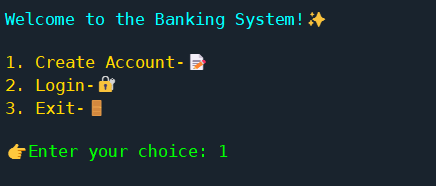
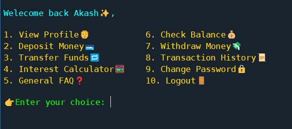
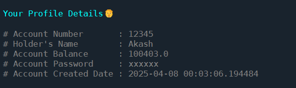
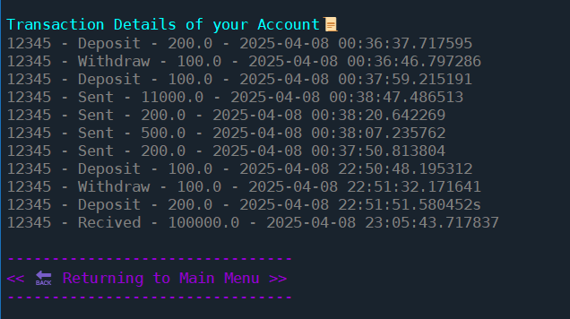

# Python Banking System (Console Project)🚀

A **simple, menu-driven Banking System** built using Python. The project allows users to perform core banking operations like creating accounts, deposits, withdrawals, fund transfers, interest calculation, and more — all using a terminal interface and `.txt` files for data storage.

---

## 📌 Table of Contents
- [About the Project](#about-the-project)
- [Features](#features)
- [Screenshots](#screenshots)
- [What I Learned](#what-i-learned)
- [Contact](#contact)
- [Project Structure](#project-structure)

---

## 📖 About the Project

This project mimics a basic banking system using Python. It demonstrates how file handling can simulate real-time banking logic without a database. All data is stored in two text files — `accounts.txt` and `transactions.txt`.

---

## ✨ Features

✅ **Create Account** – Sign up with your details and you can give your own unique account number  
✅ **Login** – Authenticate with account number and password  
✅ **Deposit Money** – Add funds to your account  
✅ **Withdraw Money** – Withdraw funds (with balance validation)  
✅ **Transfer Funds** – Transfer money to another account  
✅ **Check Balance** – See your current balance  
✅ **Transaction History** – Review all your debit/credit transactions  
✅ **Interest Calculator** – Calculate interest for a given amount and duration  
✅ **View Profile** – View your account holder details  
✅ **General FAQs** – Helpful answers to common banking-related questions  
✅ **Logout/Exit** – Exit the app safely

---

## 🖼️ Screenshots

### 🔐 Login Page


### 📋 Main Menu


### 💸 Deposit Screen


### 💳 Transaction History


---

## 📘 What I Learned

This project helped me strengthen my Python skills and apply programming logic to real-world scenarios. Here's what I gained from building this:

- 🧠 Implemented core banking operations using logic and conditionals  
- 📁 Learned file handling using `.txt` files for persistent storage  
- 💡 Improved problem-solving through menu-driven CLI design  
- 🔐 Practiced user authentication and data validation techniques  
- 🔄 Managed data flow for deposits, withdrawals, and transfers  
- 📊 Structured and modularized code for better readability and maintainability  
- 🛠️ Built a complete project without using a database — simulating backend logic with text files  

> This was not just a Python project — it was a journey through logic, creativity, and hands-on learning!

---

## 📂 Project Structure

```bash
banking-system/
├── accounts.txt         # Stores user account data
├── transactions.txt     # Stores transaction history
├── main.py              # Main driver script
├── README.md            # Project overview 
└── screenshots/         # Screenshots of app UI

```
---

## 🙌 Contributing

💡 If you have any suggestions, feel free to open an issue or ping me — I'm happy to collaborate and improve this project together!

---
 
## 📬 Contact

**Akash**  
🔗 [LinkedIn](https://www.linkedin.com)  
📧 akash.sfdc015@gmail.com  

> 🚀 Interested in building cool projects together? Let’s collaborate!

---

🛠️ Built with passion, caffeine ☕, and lots of ❤️  
by Akash 🚀

